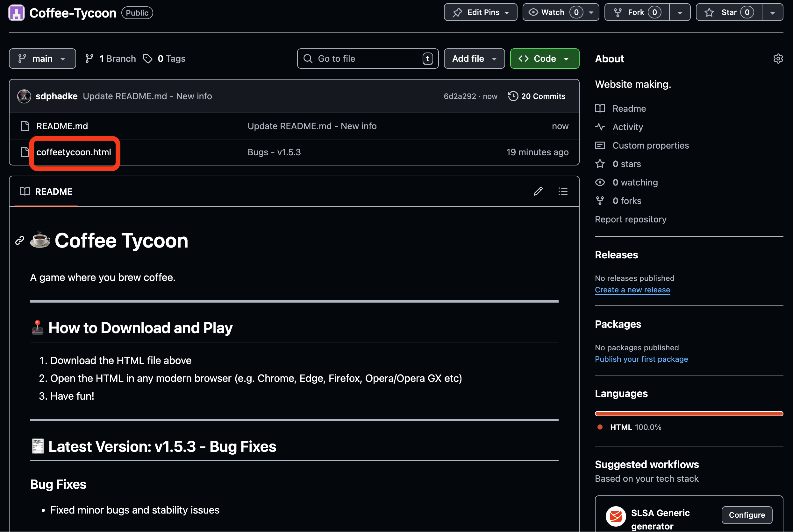
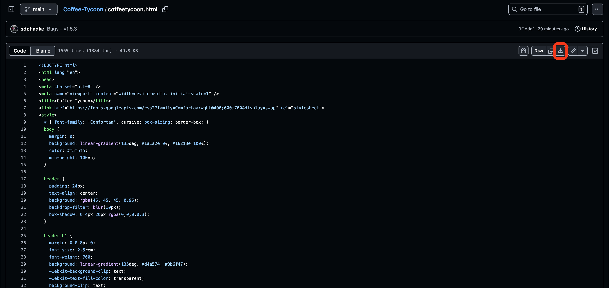
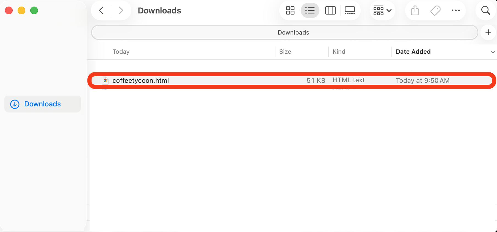

# Coffee Tycoon

A game where you brew coffee.

---

## Contents
- [How to Download and Play](#how-to-download-and-play)
  - [File Download](#option-1-file)
  - [Link to Game](#option-2-link)
- [Updates](#updates)
  - [Latest Version](#latest-version-v17--achievement-rewards)
  - [Last Major Update](#last-major-update-v16--upgrades-20)
  - [Last Major Build](#last-major-build-v10)
- [Future Updates](#future-updates)

---

## How to Download and Play

### Option 1: File
1. Download the **coffeetycoon.html** file above  
   
2. Download the file  
   
3. Open the HTML in any modern browser (Chrome, Edge, Firefox, Opera, etc.)  
   
4. Have fun!

### Option 2: Link
1. Current Link: [https://coffeetycoon.github.io/Coffee-Tycoon/](https://coffeetycoon.github.io/Coffee-Tycoon/)

---

## Updates

### Latest Version: v1.7 – Achievement Rewards
#### Release Date: Oct 14, 2025
#### New Features
- Achievements now give **bonus rewards** (coffee, production boosts, etc.)
- Reordered achievement packs and fixed overlapping issues
- Fixed game description under title (removed “money”)
- Each Golden Coffee now costs **10 billion coffee**

#### Code Cleanup
- Removed one-time global reset logic from v1.6.3  
  *(This was used only once to reset player data for that version.)*

---

### Last Major Update: v1.6 – Upgrades 2.0
#### Release Date: Oct 11, 2025
#### Main Changes
- **Upgrades**
  - Organized upgrades into packs  
  - Each pack/upgrade now unlocks progressively  
  - Added more “Produces 2x” upgrades with up to 8 such upgrades for each shop item, with the final one unlocking at 1k of that item  
  - Added upgrades for Espresso Machine, Coffee Roaster, Coffee Shop, Coffee Plantation, and Coffee Franchise  
  - Click upgrades now grant *“Clicks produce 2% of your CPS”* instead of *“+2 coffee per click”*  

- **Updated UI**
  - Added an **info button** showing current version info and upcoming updates  
  - Info menu includes a link to the GitHub repository  
  - Added a **“?” button** to replay the tutorial pop-up  

#### Bug Fixes
- Fixed minor balancing issues with upgrade pricing  
- Adjusted UI layout for better visibility  
- Fixed upgrade unlock timing inconsistencies  

---

### Last Major Build: v1.0
#### Release Date: Aug 31, 2025
#### Coffee Tycoon beta test ends, and full release is live

---

## Future Updates

### v1.7.1 - Rewards Rebalance
- Changed rewards on all achievements

### v1.8 – Notifications & UI Tweaks
- Added notifications for **new Achievements and Upgrade Packs**
- Notifications disappear after buying upgrade or claiming rewards
- Removed achievement emojis for a cleaner look
- Add **Claim All** as a button for achievements (greyed out until the corresponding upgrade is purchased)
- Add **Mark All Notifications As Read** button for upgrades

### v1.9 – TBD
- Progressive unlocking of shop items
- Add new shop items beyond Coffee Franchise
- Add bulk buying options (×1, ×10, ×100)
  - Notifications like “Bought 10× Barista”
- Add ability to **sell shop items**

---

## Undecided Additions
#### These may move to planned or unplanned updates, or be removed entirely:
- Mobile UI  
- Golden Coffee can buy **Golden Upgrades**  
  - Loses production boost but gains stronger buffs
  - Golden Upgrades (New Pack):
    - Auto-Buy Upgrades - (5 min gap between upgrades being bought - can't spam buy upgrades)
    - Auto-Buy Shop Items - (1 min gap between next cheapest item being bought)
    - Auto Claim Achievement Rewards - (Claims max one reward every minute; Level 2 upgrade claims all every 5 minutes)
- Export/Import save system using save strings  
- Erase progress option  
- Coffee cup animation (cups fall based on click/CPS output)
- Turn the CPS into a button that opens a window showing a breakdown of CPS contributions (percent and number)
- Looping Background Music: TBD
- Generic sound effect for buttons
- Affordable upgrades notifications
- Settings Button
  - Notifications for affordable upgrades (toggle)
  - Background Music toggle and SFX toggle

---
#### Only used for major update when necessary
// ===== One-time global reset for Coffee Tycoon vx.x.x =====
const GAME_VERSION = "x.x.x-reset"; // Change this if want another one-time reset

// Check stored version
const savedVersion = localStorage.getItem("gameVersion");

// If version doesn't match (or no version found), wipe save and set new version
if (savedVersion !== GAME_VERSION) {
  console.log("Performing one-time global reset for Coffee Tycoon vx.x.x");
  localStorage.clear(); // completely reset all player progress
  localStorage.setItem("gameVersion", GAME_VERSION);
}
---
*Stay tuned for more updates as Coffee Tycoon continues to brew improvements!*
